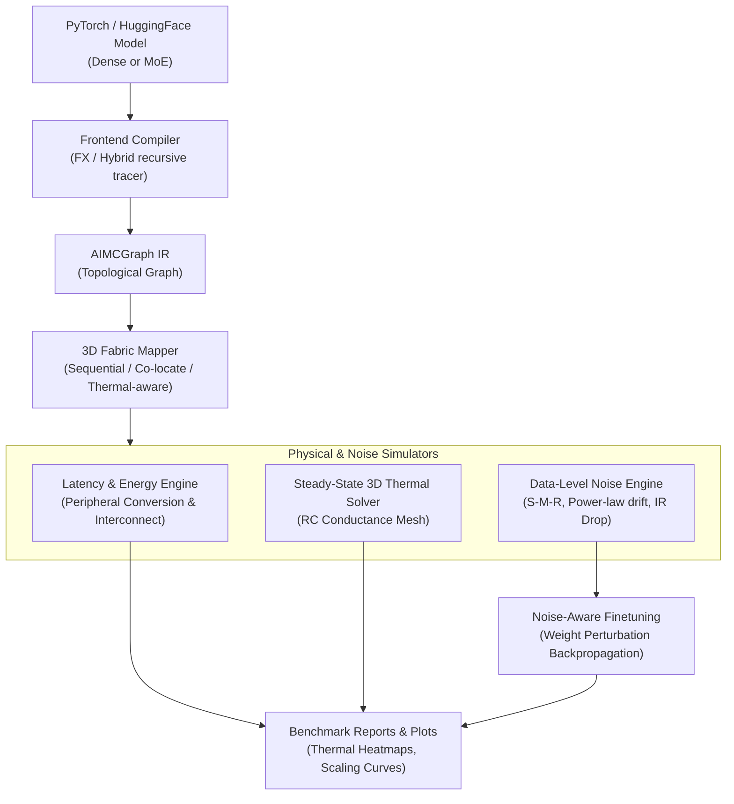

# AIMC-MoE: A Compilation and Simulation Toolchain for 3D Stacked Analog In-Memory Computing MoE Transformers

AIMC-MoE is an open-source compilation and physical simulation framework designed to compile PyTorch-based Mixture-of-Experts (MoE) Transformers and map their weights onto virtual 3D-stacked Analog In-Memory Computing (AIMC) fabrics. The toolchain models hardware-level non-idealities of non-volatile memory (NVM) crossbars (such as PCM and RRAM), estimates physical performance metrics (latency, energy, active area), solves steady-state thermal conduction networks, and supports noise-aware finetuning for accuracy recovery.

---

## Architectural Pipeline

The toolchain processes high-level PyTorch models down to individual crossbar tile mappings through the following stages:



---

## Core Features

*   **Hybrid MoE Tracing**: A recursive tracing compiler that resolves dynamic gating and routing branches to construct a hardware-agnostic intermediate representation (`AIMCGraph`).
*   **3D Stacking Mappers**: Spatial placement strategies (`SEQUENTIAL`, `EXPERT_COLOCATE`, and `THERMAL_AWARE`) that distribute embeddings, attention projections, and experts across stacked 3D active memory tiers to optimize routing distance and heat dissipation.
*   **Steady-State 3D Thermal Solver**: Solves tiered heat conduction equations across the fabric to identify thermal hotspots and grid temperature profiles.
*   **Analytical IR Drop Model**: Models position-dependent voltage and weight degradation on crossbar arrays based on physical wire resistance.
*   **Split-Map-Reorganize (S-M-R) Noise Engine**: Projects device non-idealities—such as stuck-at-faults (SAF), device-to-device (D2D) mismatches, read/programming noise, and power-law drift—directly at the tensor data level.
*   **Noise-Aware Training (NAT)**: Inserts autograd-compatible weight perturbation wrappers (`NoisyLinear`) to retrain and recover inference accuracy directly on noisy analog substrates.

---

## Mathematical Formulations

### 1. Position-Dependent IR Drop Model
To capture systematic line-resistance drops along the crossbar row and column wires, the effective conductance $G_{\text{eff}}$ at row index $i$ and column index $j$ is calculated as:

$$G_{\text{eff}}(i, j) = G(i, j) \cdot \max\left(0, 1 - \alpha (i + j) - \beta (i^2 + j^2) R_{\text{wire}}\right)$$

where $\alpha$ and $\beta$ represent first- and second-order spatial degradation coefficients, and $R_{\text{wire}}$ is the unit segment wire resistance.

### 2. Steady-State Thermal Conduction
The tiered thermal grid is solved as a steady-state resistor-capacitor (RC) network equation:

$$G_{\text{thermal}} \cdot T = B$$

where:
*   $G_{\text{thermal}}$ is the global thermal conductance matrix constructed from horizontal thermal resistance ($R_{\text{horiz}}$), vertical inter-tier resistance ($R_{\text{vert}}$), and convective boundary resistance ($R_{\text{conv}}$) on Tier 0.
*   $T$ is the temperature vector across all nodes.
*   $B$ is the boundary vector containing ambient temperature terms ($T_{\text{ambient}}$) and the power dissipation $P_{\text{tile}}$ generated by active crossbars:

$$P_{\text{tile}} = \text{utilization}_{\text{tile}} \cdot f_{\text{OPS}} \cdot E_{\text{MAC}}$$

---

## Technology Profiles

Physical presets calibrated from experimental literature:

| Preset Name | Material | Conductance Range | Programming Pulses | ADC Resolution | DAC Resolution | Energy per MAC |
| :--- | :--- | :---: | :---: | :---: | :---: | :---: |
| **RRAM HfO2** | Hafnium Oxide ($HfO_2$) | $1.0\ \mu\text{S} - 100.0\ \mu\text{S}$ | $16$ | 8 bits | 1 bit | $0.15\ \text{pJ}$ |
| **PCM GST** | Phase Change ($Ge_2Sb_2Te_5$) | $0.1\ \mu\text{S} - 10.0\ \mu\text{S}$ | $64$ | 8 bits | 4 bits | $0.25\ \text{pJ}$ |

---

## Installation

```bash
# Clone the repository
git clone https://github.com/Pouare514/aimc-moe.git
cd aimc-moe

# Install in editable mode with dev dependencies
pip install -e .[dev]
```

---

## API Usage

Compile a model, map it onto a 4-tier stack, solve the steady-state thermal system, and compute hardware metrics:

```python
import torch
from aimc_moe.frontend.adapters import trace_hf_model
from aimc_moe.backend.fabric import Fabric3D
from aimc_moe.backend.crossbar import CrossbarConfig
from aimc_moe.backend.technology import get_technology
from aimc_moe.backend.mapper import map_graph_to_fabric, MappingStrategy
from aimc_moe.metrics.thermal import ThermalConfig, solve_steady_state_temperatures
from aimc_moe.metrics.latency import compute_total_latency
from aimc_moe.metrics.energy import compute_total_energy

# 1. Ingest model configuration and trace topology
model = LoadModelArchitecture()
graph = trace_hf_model(model, seq_len=512, batch_size=1)

# 2. Configure a 3D Fabric stack with PCM GST arrays
tech = get_technology("pcm_gst")
xb_config = CrossbarConfig(rows=256, cols=256, technology=tech)
fabric = Fabric3D(mesh_rows=8, mesh_cols=8, n_tiers=4, crossbar_config=xb_config)

# 3. Execute spatial mapping
mapping = map_graph_to_fabric(graph, fabric, strategy=MappingStrategy.EXPERT_COLOCATE)

# 4. Solve steady-state temperature distribution (2 GOPS target throughput)
thermal_res = solve_steady_state_temperatures(
    fabric, mapping, config=ThermalConfig(t_ambient=25.0), ops_per_second=2e9
)
print(f"Hotspot Temperature: {thermal_res.max_temperature:.2f} C")

# 5. Extract hardware metrics
lat = compute_total_latency(graph, mapping, fabric)
energy = compute_total_energy(graph, mapping, fabric)
print(f"Latency: {lat.per_token_ns / 1e3:.2f} us | Energy: {energy.per_token_uj:.4f} uJ")
```

---

## CLI Usage

The package exposes a command-line utility `aimc-moe-sim` (also executable via `python -m aimc_moe.cli`):

1. **Trace** a surrogate model configuration to compile it to an IR Graph:
   ```bash
   python -m aimc_moe.cli trace --model-type qwen2_moe --n-layers 4 --num-experts 8
   ```

2. **Map** compiled operators onto a YAML fabric configuration preset:
   ```bash
   python -m aimc_moe.cli map --model-type olmoe --fabric configs/fabrics/pcm_medium_3d.yaml --strategy thermal-aware
   ```

3. **Simulate** physical latency, energy, footprint area, 3D thermal grid conduction, and noise impact:
   ```bash
   python -m aimc_moe.cli simulate --model-type deepseek_moe --fabric configs/fabrics/pcm_medium_3d.yaml --output outputs/sim_report.md --plot-thermal plots/thermal_grid.png
   ```

4. **Sweep** systematically across parameters (throughput rate, tiers count, noise ranges) to export comparative curves:
   ```bash
   python -m aimc_moe.cli sweep --output-dir outputs --plot-dir plots
   ```

---

## Experimental Benchmarks

Run pre-packaged simulation benchmarks:

```bash
# Evaluate dense transformer on 2D RRAM
python examples/01_dense_transformer.py

# Evaluate MoE transformer on 3D PCM with Noise-Aware Retraining
python examples/02_moe_basic.py

# Evaluate Qwen2Moe on 3D PCM with Thermal & IR Drop solver
python examples/03_huggingface_thermal.py

# Execute full parameter sweeps
python examples/04_paper_sweeps.py
```

Reports are written to `outputs/` and dark-themed visualization plots (energy/latency breakdown, 3D thermal heatmaps, accuracy loss curves) are saved under `plots/`.

---

## Codebase Organization

*   `aimc_moe/ir/`: Core Intermediate Representation (`AIMCOp`, `AIMCGraph`).
*   `aimc_moe/frontend/`: Model tracing, HuggingFace adapters, and surrogate model generators.
*   `aimc_moe/backend/`: 3D grid layouts, mapping strategies, and technology presets (PCM, RRAM).
*   `aimc_moe/metrics/`: Hardware performance estimators (latency, energy, area) and steady-state 3D Thermal RC solver.
*   `aimc_moe/noise/`: Analytical IR drop model, phenomenological NVM noise simulation, and FAME-style S-M-R projection.
*   `aimc_moe/training/`: Autograd-compatible noise injection wrappers (`NoisyLinear`) and training loops.
*   `aimc_moe/reporting/`: Plotting utilities and report generators.

---

## References

*   **IBM AIHWKIT**: Open-source framework simulating analog device non-idealities.
*   **FAME**: Fast ReRAM data-level simulator utilizing the *Split-Map-Reorganize* (S-M-R) strategy.
*   **AnalogAI**: Baseline methodologies for noise-aware neural network training.
*   **3D AIMC MoE**: Research demonstrating that combining MoE with 3D stacked CIM structures eliminates memory transfer bottlenecks during LLM generation.

---

## License

This project is licensed under the MIT License. See [LICENSE](file:///c:/codes/toolchain%20MoE%203d/LICENSE) for details.
